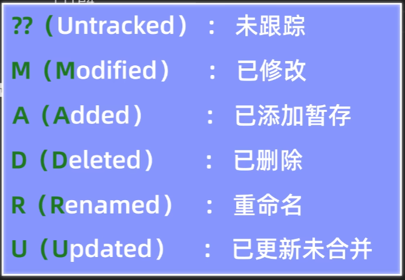
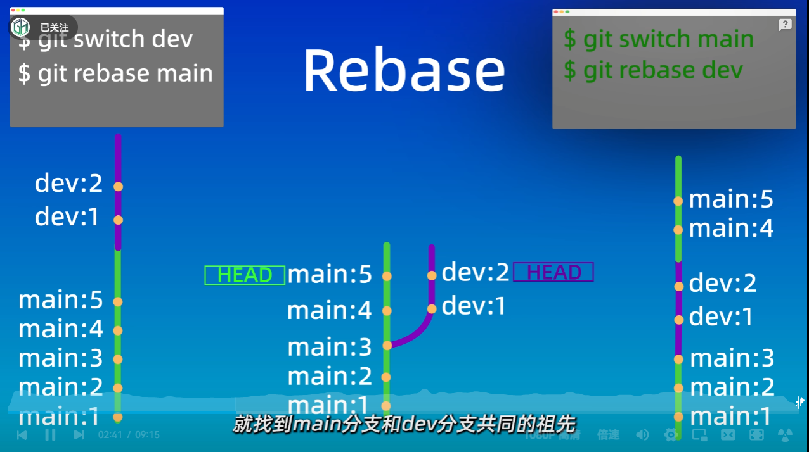
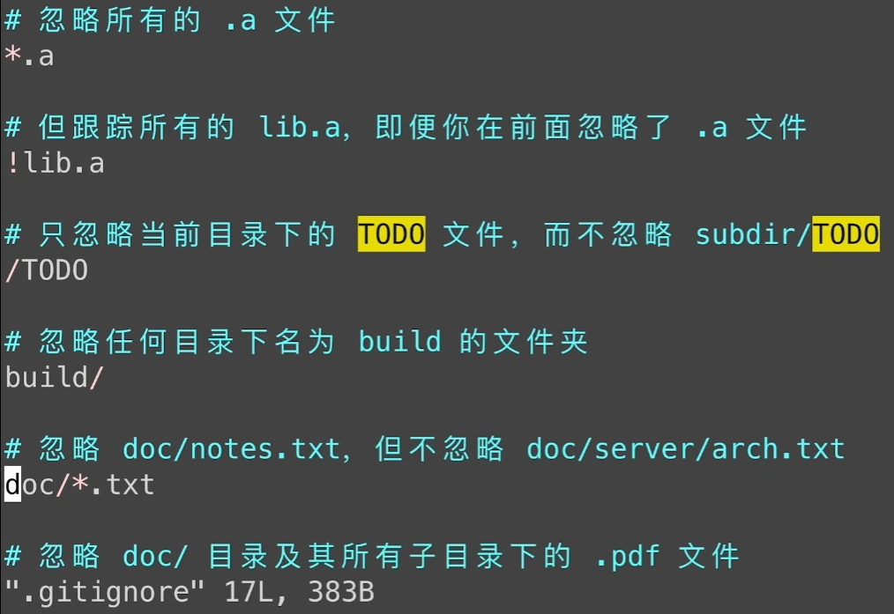

# <center>Common-command-line-commands</center>
1. 打开系统环境变量  
    - win+R,输入powershell打开管理员终端
    - 输入` rundll32 sysdm.cpl,EditEnvironmentVariables `
2. ` Ctrl + Shift + R ` 刷新网页
## 一. 文件夹操作类  
1. 进入文件夹 ` cd + 文件夹名/路径 `
2. 创建文件夹 ` mkdir + 文件夹名 `
3. 显示文件夹下的所有文件 
   - ` windows: dir ` 
   - ` linux: ls ` 
   - ` -a `参数表示显示隐藏的文件
   - ` -altr `参数表示显示隐藏的文件和修改时间
5. 退回上一个路径 `cd .. `  
6. 进入D盘 ` cd D: `

## 二. pip命令类  
1. 列出所有包 ` pip list `
2. 查看pip的所有命令 ` pip help `
3. 列出所有包的版本信息 ` pip freeze `
4. 将所有包的版本信息写入文件 ` pip freeze > requirements.txt  `
5. 安装requirements.txt中的包 ` pip install -r requirements.txt `

## 三. 文件操作类   
1. 用记事本创建.py文件 ` notepad test.py `
2. 输出字符串 ` echo print('hello world') `
3. 将echo的输出传递给下一个命令作为输出 ` echo print('hello world') | python `
4. 使用echo命令创建一个问价 ` echo "Hello World" > file.txt `
5.  查看文件的内容 ` cat file.txt `
6.  重命名或者移动文件 ` mv file.txt new_file.txt ` ` mv file.txt /path/to/destination/ `
7.  删除文件 ` rm file.txt `
8.  ` >> ` 表示追加在文件的末尾

## 四. python命令类
1. 进入python解释器交互模式 ` python `
2. 退出交互模式 `ctrl + z ` ` exit() `
3. 运行python文件 ` python test.py `
4. 传递字符串给python解释器 ` python -c "print(hello world)" `
5. 运行python文件并传递参数 ` python test.py -a -b -c `
6. 打开python帮助 ` python -h `
7. 可以直接使用py来代替python命令 ` py test.py `
   > py是python Launcher选择的命令，可以指定python版本，也可以指定虚拟环境路径.

## 五. 创建python虚拟环境
<center></center> 

1. 创建虚拟环境帮助 ` python -m venv -h `
2. 创建虚拟环境 ` python -m venv venvname ` 
3. 打印当前目录下的系统环境变量 ` echo %PATH% `
4. 在powershell中打印环境变量 ` $Env:PATH `
5. 激活虚拟环境 ` activate.bat `
   > 激活环境变量即在虚拟环境文件夹的系统变量中增加Scripts的路径. 那么首先找到的python.exe和pip.exe就是虚拟环境中的python和pip.
6. 去激活虚拟环境 ` deactivate `
7. 修改pip默认的镜像源
   - 临时修改 ` pip config set global.index-url https://mirrors.aliyun.com/pypi/simple/ `
   - 打开阿里云的镜像源库https://developer.aliyun.com/mirror/
   - 找到pypi镜像源, 复制镜像库路径
   - 在CMD中输入`pip config list -v`可以显示pip配置的路径, 然后需要修改的路径一般是第三个`'C:\Users\19463\AppData\Roaming\pip\pip.ini'`
   - 修改pip配置文件中的镜像源,输入`pip config edit --editor notepad`用记事本打开
   - 若打不开则是因为没有这个路径, 输入`pip config set x.y z`创建一个x.y的配置. 
   - 然后就可以输入` pip config edit --editor notepad `打开pip配置文件, 粘贴镜像源, 保存文件, 推出即可完成全局的镜像源配置.  
## 六. Git 命令类
1. 查看Git的版本 ` git -v `
2. 设置用户名 ` git config --global user.name "Your Name" `
3. 设置邮箱 `git config --global user.email "youremail@example.com" `
4. 保存用户名和邮箱配置 ` git config credential.helper store `
5. 查看保存的git配置 ` git config --global --list `
6. 创建仓库 ` git init ` 后面可以加上仓库的名称, 加上则表示创建一个子仓库, 不加则表示在当前文件夹下创建仓库.
7. 删除git仓库 ` rm -rf .git `
   - ` -r ` 递归删除
   - ` -f ` 强制删除
8. 查看git仓库当前状态 ` git status `
   - ` -s `表示简化形式, 第一个字符表示暂存区的状态, 第二个字符表示工作区的状态, ==?==表示未跟踪的文件, ==M==表示修改过的文件, ==D==表示删除的文件.
   <center></center> 
9.  查看暂存区的文件 ` git ls-flies `
    - ` -s  `显示详细内容
    - ` -o `显示未跟踪的文件
    - ` -i `显示被忽略的文件
10. 将文件提交到暂存区 ` git add file.txt `
11. 将文件提交至版本库中 `git commit -m "info" `这里的info是提交信息.
12. 同时完成添加和提交 ` git commit -am "info" `
13. 添加所有文件到暂存区 ` git add . `
14. 显示提交记录 ` git log ` `--oneline` 参数表示简介的提交记录
    - 显示分支状态图 ` git log --oneline --graph --decorate --all `
15. 回退版本 ` git reset + 版本号 `
    - ` --soft ` 软回退, 仅版本库中回退之前的版本, 工作区和暂存区的修改内容不变. 
    - ` --mixed ` 混合回退(默认参数), 既版本库和暂存区回退之前的版本, 工作区修改内容不变.
    - ` --hard ` 硬回退, 版本库, 暂存区, 工作区都回退到之前的版本. 
16. 删除文件 ` git rm file.txt ` 这种删除是把文件从暂存区, 以及工作区删除, 版本库中的文件还没有删除, 还需要提交修改内容
   - ` git rm --cached filename `  删除文件从暂存区, 但是工作区文件还在
   - ` git rm -r* ` 删除某个目录下的所有文件和文件夹  
17. 查看所有操作记录 ` git reflog `
18. 查看工作区和暂存区之间的差异 ` git diff ` 该命令也可以用来查看合并分支时产生的错误。
    - ` git diff HEAD `查看==工作区==和==当前版本==之间的差异
    - ` git diff HEAD^(HEAD~) `查看==工作区==和==上一个版本==之间的差异
    - ` git diff HEAD~2(HEAD^^) `查看==工作区==和==前两个版本==之间的差异  
    - ` git diff --cached `查看==暂存区==和==当前版本==之间的差异
    - ` git diff <commit_hash> <commit_hash> ` 查看==两个版本==之间的差异
19. ` git diff <commit_hash> <commit_hash> filename` 查看两个版本之间==filename==之间的差异
20. ` git diff <branch_name> <branch_name> ` 查看两个分支之间的差异
21. 在git bash中复制是` Ctrl+Shift+C `, 粘贴是` Ctrl+Shift+V `.
22. ` .gitignore `文件用来忽略文件, 忽略文件后, git将不会将这些文件纳入版本管理.
    - ` echo *.txt > .gitignore `忽略所有以.txt结尾的文件
    - 已经添加到版本库中的问价是无法进行忽略的.
    - ` temp/ `忽略temp文件夹下的所有文件
23. 克隆远程仓库 ` git clone https://github.com/user/repo.git `
24. 创建ssh密钥
    - 首先到用户根目录下, 进入.ssh目录下, 然后执行` ssh-keygen -t rsa -b 4096`生成密钥对, 默认生成的文件名为id_rsa和id_rsa.pub.
    - 回车就是默认生成的文件名为id_rsa和id_rsa.pub. 也可以自定义密钥的名字. 
    - ` vi id_rsa.pub `查看生成的公钥, 复制内容.
    - 在gitHub的设置-SSH密钥-添加公钥到gitHub上
    - 若创建不止一个密钥, 则需要进行配置. 首先在.ssh目录下创建一个config文件, 然后在config文件中添加如下内容, 其中test是密钥的名字.
    ```
    # gitHub
    Host github.com
    Hostname github.com
    PreferredAuthentications publickey
    IdentityFile ~/.ssh/test
    ```
25. 将本地仓库更新到远程仓库 ` git push `
26. 将远程仓库更新到本地仓库 ` git pull `
    - 拉取指定的远程仓库内容 ` git pull <远程仓库名> <远程分支名>:<本地分支名> ` 远程仓库名默认为origin, 远程分支名默认为main. 本地分支名默认为main. 若分支名一样可以省略。 
27. 将本地仓库放到远程仓库 ` git remote add origin https://github.com/user/repo.git `
28. 将远程仓库和本地仓库关联 ` git push -u origin main `
29. 查看远程仓库地址和名称 ` git remote -v `
30. 查看所有分支 ` git branch `
31. 创建分支 ` git branch <分支名>`
32. 切换分支 ` git checkout <分支名> ` 该命令也可以用来回复文件
    - 专门用来切换分支的命令是 ` git switch <分支名> `
33. 合并分支 ` git branch merge <分支名> `
34. 删除分支 ` git branch -d <分支名> `
35. 终止合并 ` git merge --abort `
36. 合并出现冲突之后，就要手动修改发生冲突的地方。
37. 变基合并  ` git rebase <变基分支名> ` 示意图如下：
    <center></center> 
38. 恢复分支 ` git checkout -b <分支名> <版本ID> `


## 七. 正则表达式
1. ` * `匹配任意数量的字符, 例如` *.txt `匹配所有以.txt结尾的文件.
2. ` ? `匹配任意一个字符, 例如` ?.txt `匹配以.txt结尾的文件.
3. ` [] `表示匹配列表中的单个字符, 例如` [a-z] `匹配a到z之间的任意一个字符.` [135] ` 表示匹配1或3或5.
4. ` * * `表示匹配任意中间目录.
5. ` ! ` 表示取反.
<center></center> 

## 八. vim 命令类
1. 打开vim ` vim `
2. 使用vim打开文件 ` vi filename `
3. 使用方向键控制光标的位置
4. 进入编辑模式 ` i `
5. 推出编辑模式 ` esc `
6. 退出vim ` :q `
7. 保存文件 ` :w `
8. 退出vim并保存文件 ` :wq `
9. 删除一行 ` dd `
   
## 九. Vscode 命令
1. ` Ctrl + Shift + P ` 打开命令面板
2. ` Ctrl + Shift + ` `（反引号，左上角） 打开一个终端


## 待学习的内容
1. 使用git的配置文件来创建git命令的别名
